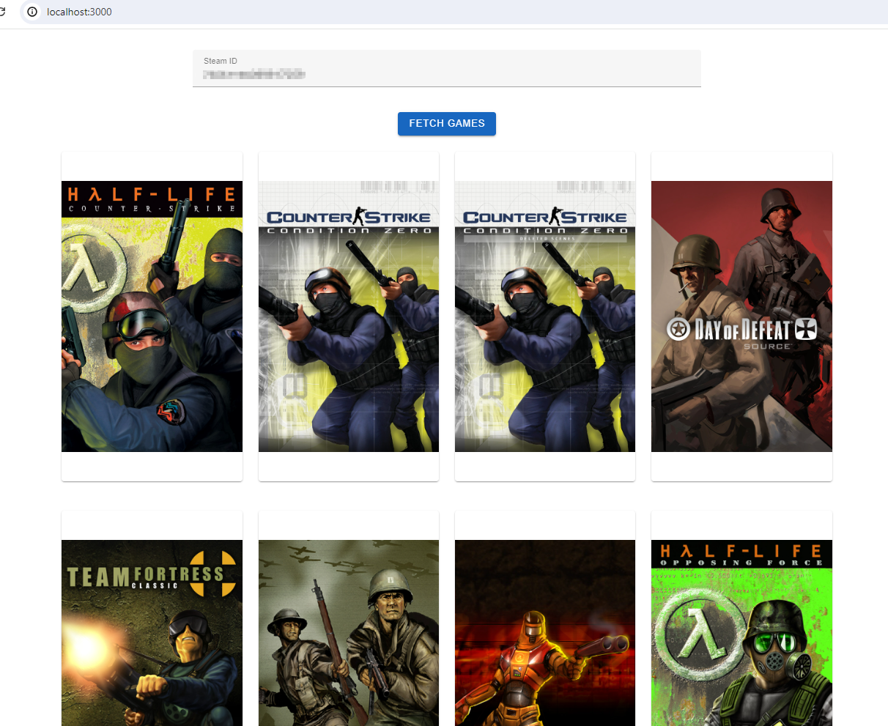

GameStore
=========

 管理自己拥有的各个平台游戏的仓库

使用Flask+Vue3来展示自己拥有的steam游戏

python虚拟环境中运行后端 `(venv) E:\dev\GameStore>flask run`  网络不好时，需要加速器来获取steam的应答

运行vue程序 `E:\dev\GameStore\frontend>npm run dev`

访问：http://localhost:3000/

TODO：

1. 本地数据库管理所有拥有游戏数据

PS:

很多年前master分支的内容是最早一版学习java数据库的代码，太陈旧了，因此移入java-hibernate分支 。

